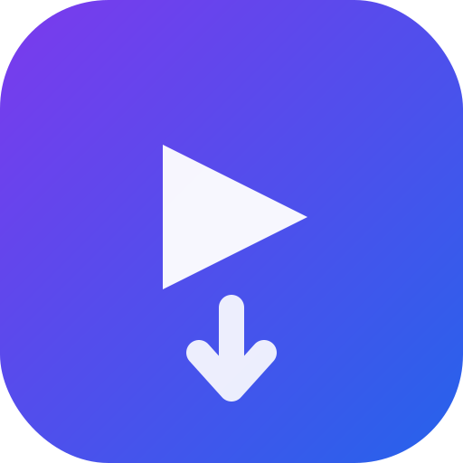

# TubeDL

A modern web-based YouTube video and music downloader powered by [yt-dlp](https://github.com/yt-dlp/yt-dlp). Search, queue, and download your favorite content with a clean, responsive interface — no ads, no tracking, no limits.



## Features

- 🔍 **Search & Download** — Search YouTube directly or paste URLs
- 🎵 **Audio & Video** — Download audio (MP3, M4A, Opus) or video (MP4)
- 📺 **Quality Options** — Choose quality for both video (Best, 1080p, 720p, 480p) and audio (Best, High, Medium)
- ⚙️ **Global Settings** — Set default preferences that persist across sessions (stored in cookies)
- 📋 **Playlist Support** — Queue entire playlists with one click
- ✂️ **Clip Trimming** — Download only specific time ranges
- 🛡️ **SponsorBlock** — Automatically skip sponsors, intros, and promotions
- 📝 **Subtitles** — Embed English subtitles in video downloads
- ⚡ **Real-time Queue** — Live progress tracking via WebSockets
- 📱 **PWA Support** — Install as a progressive web app on mobile/desktop
- 🐳 **Docker Ready** — One-command deployment with Docker Compose

## Quick Start

### Using Docker (Recommended)

```bash
# Clone and start
git clone <repository-url>
cd tubedl
docker-compose up -d

# Access at http://localhost:3000
```

### Manual Installation

**Prerequisites:**
- Node.js 18+
- Python 3.x
- [yt-dlp](https://github.com/yt-dlp/yt-dlp#installation)
- FFmpeg
- mutagen (for audio metadata)

```bash
# Install dependencies
npm install

# Start the server
npm start

# Or for development with auto-reload
npm run dev
```

## Configuration

### Environment Variables

| Variable | Default | Description |
|----------|---------|-------------|
| `PORT` | `3000` | Server port |
| `DOWNLOAD_DIR` | `./downloads` | Where downloaded files are stored |
| `MAX_CONCURRENT` | `2` | Maximum parallel downloads |
| `CLEANUP_AFTER_MS` | `3600000` (1 hour) | Auto-delete completed files after this time |

### User Settings (Cookie-based)

Click the **gear icon** in the header to set default preferences:

**Video Defaults:**
- Quality (Best, 1080p, 720p, 480p)
- Embed subtitles
- SponsorBlock
- Default clip times

**Audio Defaults:**
- Format (MP3, M4A, Opus)
- Quality (Best, High, Medium)
- SponsorBlock
- Default clip times

These settings persist across browser sessions using cookies.

### Docker Compose Example

```yaml
services:
  tubedl:
    build: .
    ports:
      - "3000:3000"
    volumes:
      - ./downloads:/app/downloads
    environment:
      PORT: 3000
      MAX_CONCURRENT: 3
      CLEANUP_AFTER_MS: 7200000  # 2 hours
```

## Usage

1. **Search** for a video or paste a YouTube URL
2. **Quick Download** — Click "Video" or "Audio" to download with your global settings
3. **Custom Download** — Click the **gear icon** on a card to override settings for that download
4. **Monitor** downloads in the queue sidebar

## API Reference

### Search
```http
GET /api/search?q=<query>&limit=12
```

### Download
```http
POST /api/download
Content-Type: application/json

{
  "videoInfo": { "id": "...", "title": "...", "thumbnail": "..." },
  "format": "video|audio",
  "quality": "best|1080p|720p|480p",
  "audioFormat": "mp3|m4a|opus",
  "audioQuality": "0|3|5",
  "sponsorBlock": false,
  "subtitles": false,
  "clipStart": "1:30",
  "clipEnd": "4:00"
}
```

### Queue Management
```http
GET    /api/queue           # List all jobs
GET    /api/queue/:id       # Get job details
POST   /api/queue/:id/cancel
POST   /api/queue/:id/retry
DELETE /api/queue/:id
```

### Download File
```http
GET /api/file/:id
```

### Playlist Info
```http
GET /api/playlist?url=<youtube-playlist-url>
```

### Stream Preview
```http
GET /api/stream/:videoId
```

### WebSocket Events
Connect to `/ws` for real-time updates:
- `queue:init` — Initial queue state on connection
- `job:added` — New download queued
- `job:updated` — Progress or status change
- `job:removed` — Download completed/removed

## Project Structure

```
tubedl/
├── server.js           # Express + WebSocket server
├── package.json
├── Dockerfile
├── docker-compose.yml
├── routes/
│   ├── search.js       # YouTube search endpoint
│   └── downloads.js    # Download queue management
├── services/
│   ├── ytdlp.js        # yt-dlp wrapper
│   └── queue.js        # Download queue with EventEmitter
├── public/             # Static web UI
│   ├── index.html
│   ├── css/
│   ├── js/
│   └── icons/
└── downloads/          # Download output directory
```

## Tech Stack

- **Backend:** Node.js, Express, WebSocket (ws)
- **Downloader:** yt-dlp, FFmpeg, mutagen
- **Frontend:** Vanilla HTML/CSS/JS (PWA)
- **Container:** Docker, Docker Compose

## Development

```bash
# Install dev dependencies
npm install

# Run with nodemon for auto-reload
npm run dev
```

## License

MIT

---

**Note:** This tool is for personal use only. Respect copyright laws and YouTube's Terms of Service when downloading content.
